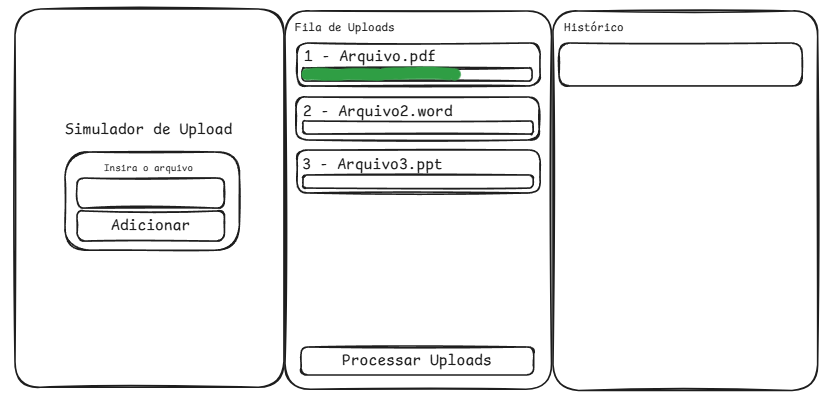
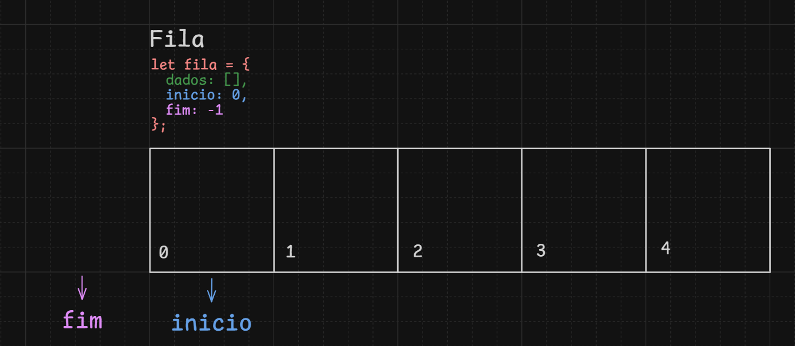
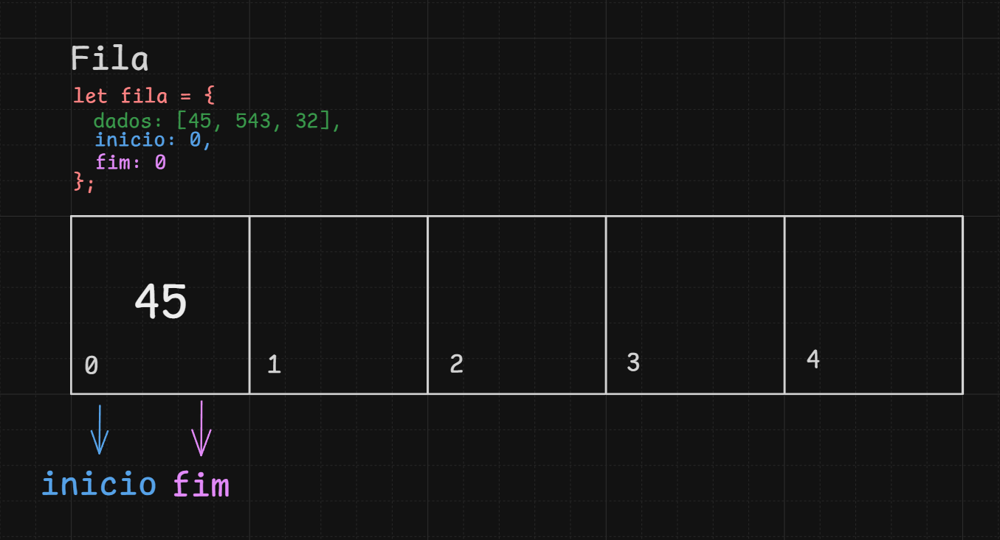
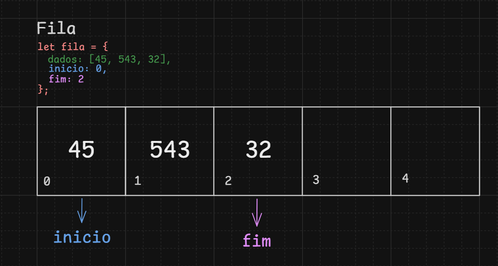
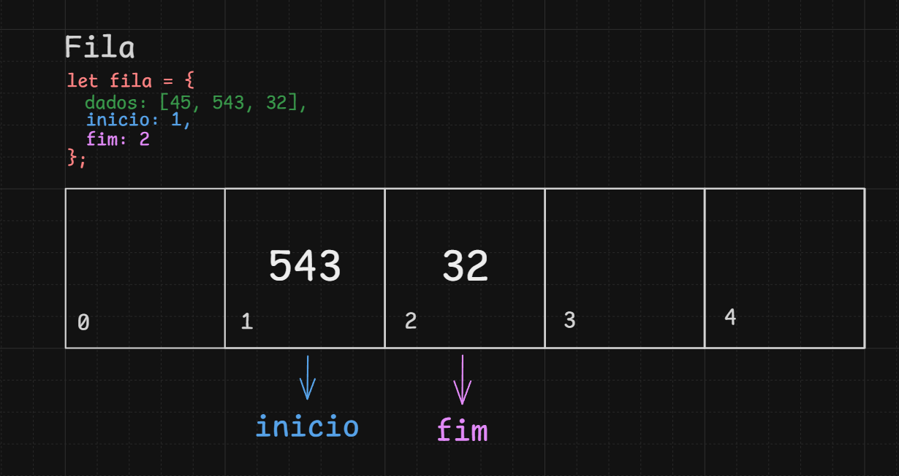
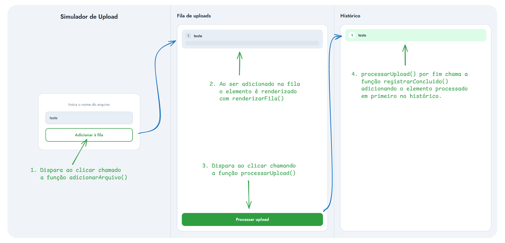

# Simulador de Upload Web

Simulador visual de uma fila de upload de arquivos, desenvolvido como projeto acadêmico final do 3º semestre do curso de TSI(Tecnologia em Sistemas para Internet). A interface permite adicionar arquivos a uma fila, processá-los um a um e acompanhar o histórico de uploads concluídos apresentando conceitos de estrutura de dados.

# Tecnologias

```markdown
- HTML5
- CSS3
- JavaScript (vanilla)
- C (Fundamentos da estrutura **fila** para base)
```

# Front-End

Front-end desenvolvido utilizando somente HTML+CSS vanilla facilitando o entendimento do código para qualquer nivel de aprendizado, desenvolvido somente para demonstrar o propósito do projeto.

## Protótipo

Para melhor otimização do desenvolvimento do projeto, o protótipo abaixo foi desenvolvido para centralizar as ideias do grupo mostrando um fluxo entre os processos do código.



# Back-End + Lógica

O back-end foi dividido em duas seções sendo:

## Lógica da Fila

Desenvolvido em JavaScript, o código abaixo demonstra a implementação e o funcionamento da estrutura de dados **Fila (Queue)**, apresentando suas principais operações, a forma como os elementos são processados e as alterações ocorridas na estrutura ao longo da execução.

```javascript
// 1. Declarando o objeto fila
let fila = {
    dados: [],  
    inicio: 0,  
    fim: -1     
};
// 2. Inicializando Fila
function inicializarFila() {
    fila.inicio = 0;
    fila.fim = -1;
}
// 3. Função necessária para verificar se a fila está vazia
function filaVazia() {
    return fila.inicio > fila.fim;
} 
// 4. Adicionando elemento na fila
function enfileirar(valor) {
    fila.fim++;              
    fila.dados[fila.fim] = valor; 
}
// 5. Atendendo/Removendo um elemento na fila
function desenfileirar() {
    if (filaVazia()) return null; 
    let valor = fila.dados[fila.inicio]; 
    fila.inicio++;                       
    return valor;                       
}
```

### Inicialização

O objeto `fila` é composto por três atributos: `dados`, que armazena os elementos; `inicio`, que aponta para o primeiro elemento da fila; e `fim`, que aponta para o último. Na inicialização, `inicio` recebe `0` e `fim` recebe `-1`,  essa combinação indica fila vazia, já que `fim < inicio` é a condição verificada por `filaVazia()`.



### Enfileiramento

Ao chamar `enfileirar(valor)`, o atributo `fim` é incrementado em 1 e o valor é inserido na posição `dados[fim]`. Em uma fila com um único elemento, `inicio` e `fim` apontam para o mesmo índice. A cada novo elemento adicionado, apenas `fim` avança, preservando a referência ao início da fila.



Exemplo adicionando mais elementos:



### Desenfileiramento

A remoção segue o modelo **FIFO** (_First In, First Out_): ao chamar `desenfileirar()`, o elemento em `dados[inicio]` é retornado e `inicio` é incrementado em 1, descartando-o da fila. O `fim` não se altera, apenas a "janela" de elementos válidos se estreita pelo início.



---
## Interações com o DOM

### Variaveis de Controle

Duas variáveis globais auxiliam o gerenciamento do estado da interface: `processando` impede que um novo upload seja iniciado enquanto outro ainda está em andamento; `totalConcluidos` registra um contador incremental caso necessário posteriormente.

```javascript
let processando = false;
let totalConcluidos = 0;
```

### Adicionar Arquivos

Lê o valor do campo de texto identificado por `arquivo`, valida se não está vazio e chama `enfileirar()` com o nome digitado. Em seguida, aciona `renderizarFila()` para atualizar a mudança na tela e limpa o campo, devolvendo o foco para o usuário. O `addEventListener` associado ao campo permite que a mesma ação seja disparada pressionando **Enter**, sem necessidade de clicar no botão.

```javascript
function adicionarArquivo() {
    const campo = document.getElementById("arquivo");
    const nome  = campo.value.trim();
    if (nome === "") {
        alert("Digite o nome do arquivo");
        return;
    }
    enfileirar(nome);
    renderizarFila();
    campo.value = "";
    campo.focus();
}

document.getElementById("arquivo").addEventListener("keydown", e => {
    if (e.key === "Enter") adicionarArquivo();
});
```
### Renderizar Fila

É responsável por sincronizar o estado interno da fila com o que o usuário vê na tela. A cada chamada, todos os cartões existentes são removidos e recriados do zero, garantindo que a numeração e a ordem reflitam sempre o estado atual de `fila.inicio` até `fila.fim`.

Para cada elemento, é criado um cartão com seu número de posição relativa, o nome do arquivo e uma barra de progresso identificada por `barra-{i}`. O primeiro elemento recebe a classe `ativo` enquanto `processando` for verdadeiro, destacando visualmente qual arquivo está sendo processado no momento. Se a fila estiver vazia, a mensagem de fila vazia é exibida no lugar dos cartões.

```javascript
function renderizarFila() {
    const container = document.getElementById("cartoes-fila");
    const msgVazia  = document.getElementById("fila-vazia");
    Array.from(container.querySelectorAll(".cartao-arquivo")).forEach(el => el.remove());
    if (filaVazia()) {
        msgVazia.style.display = "";
        return;
    }
    msgVazia.style.display = "none";
    for (let i = fila.inicio; i <= fila.fim; i++) {
        const posicao  = i - fila.inicio + 1;
        const ehAtivo  = (i === fila.inicio && processando);
        const cartao = document.createElement("div");
        cartao.className = "cartao-arquivo" + (ehAtivo ? " ativo" : "");
        cartao.id = "cartao-" + i;
        cartao.innerHTML = `
            <div class="cabecalho-cartao">
                <span class="numero-cartao">${posicao}</span>
                <span class="nome-arquivo">${fila.dados[i]}</span>
            </div>
            <div class="barra-progresso">
                <div class="barra-preenchida" id="barra-${i}"></div>
            </div>
        `;
        container.appendChild(cartao);
    }
}
```
### Processar Upload

Inicia o processamento do primeiro elemento da fila. Antes de executar, verifica se já há um upload em andamento (`processando`) ou se a fila está vazia, interrompendo nos dois casos. Ao iniciar, marca `processando = true`, renderiza a fila para ativar o destaque visual e inicia um `setInterval` que incrementa a largura da barra de progresso a cada 150ms.

Ao atingir 100%, o intervalo é encerrado, o elemento é removido da fila via `desenfileirar()`, o arquivo é registrado como concluído e `processando` volta para `false`. Se ainda houver elementos na fila, o próximo upload é iniciado automaticamente após 400ms via `setTimeout`.

```javascript
function processarUpload() {
    if (processando) return;
    if (filaVazia()) {
        alert("A fila está vazia! Adicione arquivos primeiro.");
        return;
    }
    const nomeAtual = fila.dados[fila.inicio];
    const indiceAtual = fila.inicio;
    processando = true;
    renderizarFila();
    let porcentagem = 0;
    const intervalo = setInterval(() => {
        porcentagem += 5;
        const barra = document.getElementById("barra-" + indiceAtual);
        if (barra) barra.style.width = porcentagem + "%";
        if (porcentagem >= 100) {
            clearInterval(intervalo);
            desenfileirar();
            registrarConcluido(nomeAtual);
            processando = false;
            renderizarFila();
            if (!filaVazia()) {
                setTimeout(() => processarUpload(), 400);
            }
        }
    }, 150);
}
```

### Registrar como Concluido

Chamada ao final de cada upload, incrementa `totalConcluidos`, oculta a mensagem de histórico vazio e cria um cartão com o número sequencial e o nome do arquivo. O cartão é inserido no início da lista com `insertBefore`, fazendo com que o mais recente sempre apareça no topo do histórico.

```javascript
function registrarConcluido(nome) {
    totalConcluidos++;
    document.getElementById("historico-vazio").style.display = "none";
    const lista = document.getElementById("lista-concluidos");
    const cartao = document.createElement("div");
    cartao.className = "cartao-concluido";
    cartao.innerHTML = `
        <span class="numero-concluido">${totalConcluidos}</span>
        <span class="nome-concluido">${nome}</span>
    `;
    lista.insertBefore(cartao, lista.firstChild);
}
```

# Front-End + Interações

## Fluxo de acões da interface:

Na coluna esquerda, o usuário digita o nome de um arquivo e o adiciona à fila pelo botão ou pressionando **Enter**. A coluna central exibe a fila em tempo real, cada arquivo aparece como um cartão com sua posição, nome e barra de progresso. O botão _Processar upload_ inicia o processamento sequencial. A coluna direita registra o histórico de arquivos concluídos, sempre com o mais recente no topo.



## Estilização

- Fonte utilizada é **Jost** (Google Fonts), importada com os pesos 400, 500, 600 e 700.
- A paleta é composta (`#f0f4f8`, `#c5d2e0`, `#e8eef5`) e verde tema do Instituto Federal de São Paulos (`#2f9e41`) como cor de ação e progresso, criando contraste claro entre elementos neutros e interativos.
- O layout utiliza **Flexbox** em dois níveis: `main` distribui as três colunas horizontalmente com `flex: 1` em cada uma; dentro de cada coluna, os elementos são empilhados verticalmente com `gap` uniforme.
# Ferramentas e usa de Inteligência Artificial
## Aplicação da IA

- **ChatGPT** - auxílio na idealização e explicação do código, com foco didático no aprendizado da estrutura de fila.
- **Claude** - formatação e revisão dos textos de documentação, promovendo clareza para o leitor.
## Ferramentas

-  **Git** e **GitHub** - versionamento, trabalho colaborativo e hospedagem do projeto.
- **Visual Studio Code** - editor de código utilizado no desenvolvimento.
- **Google Fonts** - importação da fonte utilizada na interface.
- **Excalidraw** - prototipação e documentação visual do fluxo da aplicação.

# Considerações Finais

Este projeto foi desenvolvido com o objetivo de aplicar na prática os conceitos estudados ao longo da disciplina de Estrutura de Dados, consolidando o entendimento sobre filas, manipulação do DOM e desenvolvimento de interfaces interativas.

Agradecemos ao professor **Carlos Henrique da Silva Santos** pela condução da disciplina, pela didática e pelo incentivo ao aprendizado prático.

---
## Autores

<table>
  <tr>
    <td align="center">
      <a href="https://github.com/Ramos902">
        
        <br><sub>Ramos</sub>
      </a>
    </td>
    <td align="center">
      <a href="https://github.com/andrwza">
        
        <br><sub>Andreza</sub>
      </a>
    </td>
  </tr>
</table>
